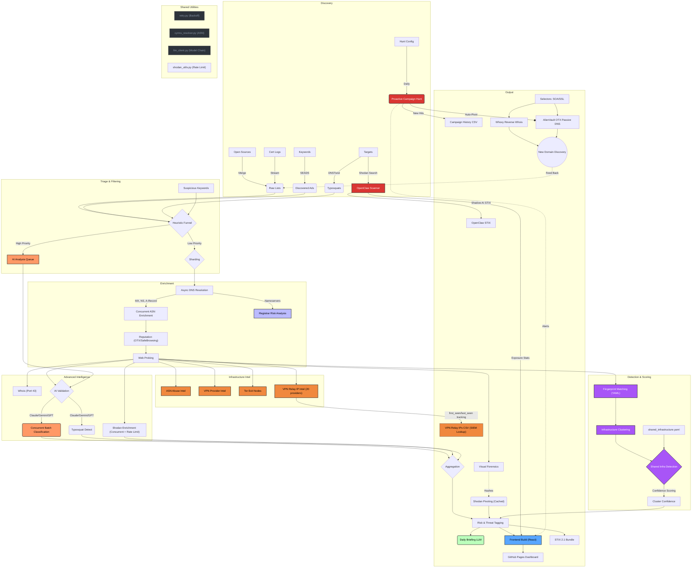
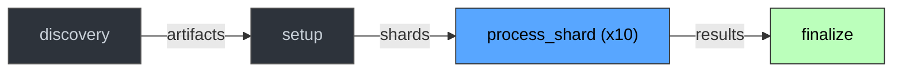

<p align="center">
  
</p>

<p align="center">
  <strong>Automated threat intelligence platform for disposable email, typosquatting, and abuse infrastructure detection.</strong>
</p>

<p align="center">
  <a href="https://github.com/elchacal801/domain_intel/actions/workflows/update_intelligence.yml"></a>
  <a href="LICENSE"></a>
  
  
  
  
  
</p>

<p align="center">
  <a href="https://elchacal801.github.io/domain_intel/"><strong>View Live Dashboard</strong></a>
</p>

---

## Table of Contents

- [Key Features](#key-features)
- [Live Dashboard](#live-dashboard)
- [Architecture](#architecture)
- [How to Use This Intelligence](#how-to-use-this-intelligence)
- [Quick Start](#quick-start)
- [Pipeline Deep Dive](#pipeline-deep-dive)
- [Configuration Reference](#configuration-reference)
- [Project Structure](#project-structure)
- [CI/CD & Automation](#cicd--automation)
- [Testing](#testing)
- [Data Dictionary](#data-dictionary)
- [Responsible Use & Security](#responsible-use--security)
- [Contributing](#contributing)
- [Documentation](#documentation)
- [Acknowledgments](#acknowledgments)
- [License](#license)

---

## Key Features

| Category | Capability |
|---|---|
| **Automated Pipeline** | Daily GitHub Actions workflow with 10-shard parallel processing, artifact passing, and auto-commit to GitHub Pages |
| **AI-Powered Analysis** | Multi-model LLM chain (Claude Sonnet 4.5 / Gemini 3 Pro / GPT-4o) with automatic fallback, SQLite caching, and cost tracking |
| **Infrastructure Clustering** | Groups domains by shared MX hosts, MX IPs, web hosting IPs, and registrar+NS — with confidence scoring that penalizes known shared providers |
| **Fingerprint Detection** | 11 YAML-driven fingerprint rules with confidence modifiers, entity screening boosts, and FLAME threat-path mapping |
| **FLAME Integration** | Maps clusters to [FLAME](https://github.com/elchacal801/flame-fraud) fraud threat paths with evidence package generation |
| **STIX 2.1 Export** | Full STIX bundle generation for direct ingestion into OpenCTI, MISP, or any CTI platform |
| **Shadow AI Scanner** | Detects exposed OpenClaw/Moltbot/Gateway AI agents on port 18789 via Shodan with STIX + Sigma rule export |
| **Remote Access Detection** | Finds internet-exposed IP-KVM hardware (PiKVM, TinyPilot, JetKVM, NanoKVM, GLKVM) and RMM tooling (RustDesk, AnyDesk, TeamViewer, ScreenConnect, MeshCentral) — the laptop-farm pattern behind DPRK IT-worker operations, mapped to MITRE T1219.003 |
| **Investigation Dashboard** | React 19 + Vite 7 + Tailwind CSS 4 frontend with Sigma.js graph visualization, TanStack Table, and fuzzy search |
| **Proactive Discovery** | SEADS ad scanning, dnstwist permutation generation, Certificate Transparency log streaming, and Shodan campaign hunts |
| **Entity Screening** | Cross-references domains against GLEIF (corporate registry), OpenSanctions (PEPs/sanctions), and ICIJ OffshoreLeaks |
| **Threat Feed Matching** | Checks domains against PhishTank, URLhaus, VirusTotal, and AlienVault OTX |
| **Visual Forensics** | Headless browser screenshots with perceptual hashing (pHash) to cluster identical phishing kits |

> [!NOTE]
> This repository **updates itself automatically** every day via GitHub Actions. The data in `data/` is always current.

---

## Live Dashboard

> **[https://elchacal801.github.io/domain_intel/](https://elchacal801.github.io/domain_intel/)**

The dashboard provides six investigation views:

| Page | Description |
|---|---|
| **Matches** | Fingerprint match table with KPI cards, multi-select filters (fingerprint, TLD, registrar), sorting, pagination, and CSV export |
| **Investigate** | Global domain search with fuzzy matching. Click any domain for a full detail page with DNS, reputation, AI classification, Shodan, VirusTotal, FLAME mappings, and resolution chain |
| **Clusters** | Interactive Sigma.js force-directed graph of infrastructure clusters. Table view with shared-infra detection, confidence scoring, and drill-down to connected domains |
| **Intel Briefing** | AI-generated daily intelligence briefing in IC-style format — BLUF, strategic assessment, operational intelligence, campaign highlights, risk signals, action items, and FLAME evidence candidates |
| **Compare** | Side-by-side domain comparison showing infrastructure overlap, shared clusters, and risk signal differences |

---

## Architecture

Domain Intel operates as a **daily batch pipeline** that discovers, triages, enriches, analyzes, and publishes threat intelligence — entirely automated via GitHub Actions.

### At a Glance

```
Discovery (ads, typosquats, CT logs, Shodan hunts)
    │
    ▼
Triage (keyword + target matching → reduce 200k+ → ~10k candidates)
    │
    ▼
Sharding (split into 10 chunks for parallel processing)
    │
    ▼
Enrichment (DNS/MX/NS/ASN resolution → reputation → web probing)
    │
    ▼
Infrastructure Intel (ASN abuse, VPN relay IPs, Tor exit nodes)
    │
    ▼
Advanced Intel (Shodan, VirusTotal, PhishTank, GLEIF, OpenSanctions, ICIJ, Whois)
    │
    ▼
AI Analysis (typosquat detection + web intent classification + daily briefing)
    │
    ▼
Detection & Scoring (YAML fingerprints → infrastructure clustering → confidence scoring)
    │
    ▼
Output (STIX 2.1 bundle, React dashboard, JSON APIs, CSV exports)
```

### Detailed Pipeline Diagram



---

## How to Use This Intelligence

### For SOC & Fraud Analysts

| File | Use Case |
|---|---|
| `data/dea_domains.csv` | Block signups from disposable/temporary email services |
| `data/discovered_ads.csv` | Block domains actively abusing search engine ads |
| `data/potential_typosquats.csv` | Monitor for new registrations impersonating your brand |
| `data/ai_typosquats.csv` | AI-validated typosquatting domains with confidence scores |
| `data/phishtank_matches.csv` | Domains confirmed on PhishTank/URLhaus feeds |
| `data/fingerprint_matches.csv` | Domains matching known abuse infrastructure patterns |

### For Threat Researchers

| File | Use Case |
|---|---|
| `data/dea_domains_probed.csv` | Full enriched dataset — DNS, ASN, MX, web probe, reputation |
| `data/risky_asn_list.csv` | Hosting providers that tolerate abuse (bulletproof hosting) |
| `data/campaign_hunt_history.csv` | Infrastructure discovered by automated Shodan campaign hunts |
| `data/shodan_intelligence.csv` | Shodan enrichment for triaged candidates (ports, services, vulns) |
| `data/enriched_candidates.csv` | Technical enrichment with DNS/SSL history and pivot selectors |
| `data/vpn_relay_ips.csv` | VPN relay IPs from 20 providers with temporal tracking (`first_seen`/`last_seen`/`active`) — full master dataset |
| `data/vpn_relay_lookup.csv` | Lean <10 MB projection of the relay master, for CrowdStrike LogScale / SIEM lookup-table upload |
| `data/vpn_relay_lookup.json` | Active-only JSON array of the same fields, for CrowdStrike Fusion SOAR HTTP-action pulls (JSONPath-parseable) |
| `data/openclaw_exposed.csv` | Exposed Shadow AI agents (OpenClaw/Moltbot) with IPs and ports |

### For Engineering & DevOps

| File | Use Case |
|---|---|
| `data/domain_intel_bundle.json` | STIX 2.1 bundle for OpenCTI, MISP, or any CTI platform |
| `data/openclaw_stix.json` | STIX bundle for Shadow AI exposure indicators |
| `data/openclaw_sigma.yml` | Sigma detection rule for SIEM ingestion |
| `data/dashboard_summary.json` | Pre-computed KPIs without parsing large CSVs |
| `data/daily_briefing.json` | Structured JSON briefing for Slack/email integration |

---

## Quick Start

### Prerequisites

| Requirement | Version | Purpose |
|---|---|---|
| Python | 3.10+ | Pipeline scripts |
| Node.js | 20+ | Dashboard build |
| pip | Latest | Python dependency management |
| npm | Latest | Frontend dependency management |

### Installation

```bash
# Clone the repository
git clone https://github.com/elchacal801/domain_intel.git
cd domain_intel

# Install Python dependencies
pip install -r requirements.txt

# Install frontend dependencies
cd frontend && npm install && cd ..
```

### API Keys

Create a `.env` file in the project root. All keys are optional — the pipeline degrades gracefully when keys are missing.

| Variable | Provider | Required For | Free Tier |
|---|---|---|---|
| `OPENAI_API_KEY` | OpenAI | AI analysis (GPT-4o fallback) | Pay-per-use |
| `GEMINI_API_KEY` | Google | AI analysis (Gemini secondary) | Yes |
| `ANTHROPIC_API_KEY` | Anthropic | AI analysis (Claude primary) | Pay-per-use |
| `SHODAN_API_KEY` | Shodan | Port/service enrichment, campaign hunts, OpenClaw scanning | Yes (limited) |
| `VT_API_KEY` | VirusTotal | Malware/phishing reputation | Yes (4 req/min) |
| `WHOXY_API_KEY` | Whoxy | Reverse Whois pivoting | Pay-per-use |
| `ALIENVAULT_OTX_API_KEY` | AlienVault | OTX passive DNS pivoting | Yes |
| `CENSYS_API_KEY` | Censys | Certificate Transparency discovery | Yes (limited) |

```env
# .env (example)
ANTHROPIC_API_KEY=sk-ant-...
GEMINI_API_KEY=AIza...
OPENAI_API_KEY=sk-...
SHODAN_API_KEY=...
```

For GitHub Actions, add these as **Repository Secrets** in Settings > Secrets and variables > Actions.

### Running the Pipeline Locally

```bash
# 0. Proactive discovery (optional; requires SHODAN_API_KEY)
python scripts/hunt_campaign.py     # disposable-email infrastructure
python scripts/hunt_kvm.py          # internet-exposed IP-KVM devices

# 1. Merge and deduplicate source lists
python scripts/merge_lists_v3b.py --include-stopforumspam

# 2. Split into shards for parallel processing
python scripts/split_data.py --input data/pipeline_input.csv --chunks 10 --output-prefix data/dea_part

# 3. Process a single shard (repeat for each shard, or run in parallel)
python scripts/enrich_infrastructure.py --input data/dea_part_0.csv --output temp_infra.csv --workers 200
python scripts/enrich_reputation.py --input temp_infra.csv --output temp_rep.csv
python scripts/probe_web.py --input temp_rep.csv --output data/result_part_0.csv --workers 50

# 4. Merge all shards
python scripts/merge_results.py --pattern "data/result_part_*.csv" --output data/dea_domains_probed.csv

# 5. Infrastructure intel & data hygiene
python scripts/asn_intel.py
python scripts/vpn_intel.py
python scripts/tor_intel.py
python scripts/clean_data.py
python scripts/enrich_asns.py

# 6. Triage and advanced enrichment
python scripts/triage_domains.py
python scripts/enrich_shodan.py --input data/triage_candidates.csv --budget 2500 --limit 2000

# 7. AI analysis (requires at least one LLM API key)
python scripts/ai_typosquat.py --limit 2000 --batch-size 100 --input data/triage_candidates.csv
python scripts/ai_classify_web.py --limit 2000 --batch-size 50
python scripts/ai_briefing.py

# 8. Detection & scoring
#    Must precede match_fingerprints.py: FP-0011 matches the columns it writes.
python scripts/enrich_rmm_exposure.py   --ip-list data/known_campaign_ips.txt   --source data/dea_domains_probed.csv:a_record   --source data/vpn_relay_ips.csv:ip   --output data/rmm_exposure.csv   --annotate data/dea_domains_probed.csv   --budget 1000
python scripts/match_fingerprints.py
python scripts/build_frontend_data.py
python scripts/generate_pivots.py --input data/dea_domains_probed.csv

# 9. Export
python scripts/export_stix.py --input data/dea_domains_probed.csv
python scripts/build_dashboard_data.py

# 10. Build the dashboard
cd frontend && npm run build
```

### Development Server

```bash
cd frontend
npm run dev    # Starts Vite dev server at http://localhost:5173
```

---

## Pipeline Deep Dive

### 1. Discovery (The Net)

Multiple discovery mechanisms cast a wide net to find suspicious domains before they're used in attacks:

| Script | Method | Description |
|---|---|---|
| `merge_lists_v3b.py` | Open-source aggregation | Merges public DEA/abuse lists, StopForumSpam data, and prior discoveries |
| `run_seads.py` | SEADS ad scanning | Searches search engines for malicious ads targeting keywords in `config/seads_keywords.txt` |
| `generate_permutations.py` | dnstwist | Generates typosquat permutations for high-value targets in `config/targets.txt` |
| `discover_ct.py` | Certificate Transparency | Streams CT logs via Censys for certificates matching target patterns |
| `hunt_campaign.py` | Shodan campaign hunt | Proactively hunts for specific campaign infrastructure fingerprints |

### 2. Triage (The Funnel)

`triage_domains.py` reduces 200k+ ingested domains to ~10k high-priority candidates using local heuristics:

- **High-value target matching**: Fuzzy matching against brands like major banks, tech companies, and crypto platforms
- **Keyword signals**: Domains containing `login`, `update`, `verify`, `secure`, `wallet`, `confirm`
- **Result**: Expensive enrichment (Shodan, VirusTotal, AI) runs only on triaged candidates

### 3. Enrichment (The Microscope)

Each shard is enriched in three passes:

1. **Infrastructure** (`enrich_infrastructure.py`): Bulk async DNS resolution for MX, NS, and A-records. IP → ASN mapping via Team Cymru DNS.
2. **Reputation** (`enrich_reputation.py`): RBL checks and RDAP queries for registrar/creation date.
3. **Web Probing** (`probe_web.py`): HTTP/S fingerprinting capturing page titles, server headers, status codes, and redirect chains. Rate-limited with identifiable User-Agent (`DomainIntelResearch/1.0`).

### 4. Advanced Intelligence

After merge, the full dataset receives deeper enrichment:

| Script | Source | Rate Limit |
|---|---|---|
| `enrich_shodan.py` | Shodan | 1 RPS, credit-budgeted |
| `enrich_virustotal.py` | VirusTotal | 4 RPM, credit-budgeted |
| `enrich_phishtank.py` | PhishTank + URLhaus | Bulk feed download |
| `enrich_gleif.py` | GLEIF | Bulk API with local caching |
| `enrich_opensanctions.py` | OpenSanctions | Bulk dataset with local caching |
| `enrich_icij.py` | ICIJ OffshoreLeaks | Bulk dataset with local caching |
| `enrich_dnstwist.py` | dnstwist cross-reference | Local |
| `enrich_technical.py` | DNS/SSL history | 50 concurrent workers, 5k/run cap |
| `enrich_pivot.py` | Whoxy reverse Whois | API-budgeted |
| `drip_whois.py` | Port 43 Whois | Slow drip, separate workflow |

### 5. AI Analysis (The Laser)

LLM analysis runs only on triaged candidates to control costs. The model chain (`scripts/shared/llm_client.py`) automatically falls through on failure:

| Task | Primary Model | Use |
|---|---|---|
| **Daily Briefing** | Claude Sonnet 4.5 | IC-style executive intelligence briefing with FLAME evidence candidates |
| **Web Classification** | Claude Haiku 4.5 | Classifies web page intent: phishing, legitimate, parked, C2, error |
| **Typosquat Detection** | Claude Haiku 4.5 | Detects semantic typosquatting beyond edit-distance heuristics |

All responses are cached in SQLite (`data/.llm_cache/`) with 7-day TTL. Per-call costs are logged to `data/llm_cost_log.csv`.

### 6. Detection & Scoring

#### Fingerprint Matching (`match_fingerprints.py`)

Nine YAML-defined fingerprint rules in `config/fingerprints/` match domains against known abuse infrastructure patterns:

| ID | Name | Key Indicators |
|---|---|---|
| FP-0001 | OVH cPanel DEA Infrastructure | ASN 16276 + cprapid.com NS + temp-mail-pro.com MX |
| FP-0002 | Alibaba App Sideloading Infrastructure | Alibaba ASN + sideloading patterns |
| FP-0003 | Crypto/Finance Fraud Co-hosting | Shared hosting with crypto/finance scam indicators |
| FP-0004 | Gname Registrar + Cloudflare China Hosting | Gname registrar + Cloudflare China infrastructure |
| FP-0005 | GoDaddy Bulk Registration Pattern | Bulk GoDaddy registrations with common abuse signals |
| FP-0006 | Coordinated Shell Domain Network (MX Clustering) | Shared MX cluster patterns indicating coordinated registration |
| FP-0007 | Typosquat Evasion Infrastructure | Infrastructure patterns used to evade typosquatting detection |
| FP-0008 | Pickelhost/Eye-Mail ULA SPF Phishing Platform | 18+ actor-operated DEA services as MX + ULA IPv6 SPF records |
| FP-0009 | IPIDEA Residential Proxy Network Infrastructure | C2/SDK domains for ~9M-device residential proxy network (disrupted by Google GTIG Jan 2026) |

Each fingerprint has a `confidence_base` score modified by entity screening results (GLEIF, OpenSanctions, ICIJ, VirusTotal, PhishTank, SecurityTrails history), producing a final confidence score per domain.

#### Infrastructure Clustering (`build_frontend_data.py`)

Domains are grouped into clusters by four infrastructure dimensions:

1. **MX Host** — shared mail exchange servers
2. **MX Server IP** — shared MX IP addresses
3. **Web Hosting IP** — shared A-record IPs
4. **Registrar + NS** — same registrar and nameserver combination

Cluster confidence uses **inverted semantics** via `config/shared_infrastructure.yaml`:
- Clusters on **known shared providers** (Cloudflare, AWS, Google, etc.) receive **penalties** — co-location is expected
- Clusters on **unknown/dedicated IPs** receive **high confidence** — co-location is a strong signal
- Large clusters on unknown infrastructure receive **size bonuses** for A-record IPs

---

## Configuration Reference

### `config/defaults.yaml`

Central configuration for AI model chains, API budgets, rate limits, and file paths.

```yaml
ai:
  briefing:
    model_chain:
      - "anthropic/claude-sonnet-4-5-20250929"   # Primary
      - "gemini/gemini-3-pro-preview"             # Secondary
      - "gpt-4o"                                   # Tertiary
      - "gemini/gemini-flash-latest"               # Emergency fallback
  classification:
    model_chain:
      - "anthropic/claude-haiku-4-5-20251001"     # Cost-optimized
      - "gemini/gemini-flash-latest"
      - "gpt-4o"

shodan:
  budget_default: 20
  rate_limit_rps: 1

virustotal:
  budget_default: 500
  rate_limit_rpm: 4
  cache_ttl_days: 7
```

### `config/shared_infrastructure.yaml`

Defines known shared infrastructure providers (email, DNS, web hosting) with MX patterns, NS patterns, and ASN lists. Used by the clustering engine to adjust confidence scores. Includes 25+ providers: Cloudflare, Google Workspace, Microsoft 365, AWS, Akamai, Fastly, DigitalOcean, Hetzner, OVH, and more.

### `config/fingerprints/*.yaml`

Each YAML file defines a fingerprint rule with:
- `indicators` — required and optional field matches (exact, contains, range)
- `confidence_base` — starting confidence score
- `confidence_modifiers` — adjustments from entity screening, VirusTotal, PhishTank, SecurityTrails
- `flame_tp_ids` — mapping to FLAME threat paths
- `ttl_days` — how long a match remains valid

### `config/seads_keywords.txt`

Keywords for SEADS ad scanning (brand names, financial terms, etc.).

### `config/targets.txt`

High-value targets for dnstwist typosquat generation.

---

## Project Structure

```
domain_intel/
├── frontend/                    # React 19 investigation dashboard
│   ├── src/
│   │   ├── components/          # 13 reusable components
│   │   │   ├── Layout.jsx       #   App shell with nav, search, theme toggle
│   │   │   ├── SigmaGraph.jsx   #   Force-directed graph (Sigma.js + Graphology)
│   │   │   ├── GlobalSearch.jsx #   Fuzzy search across all domains (Fuse.js)
│   │   │   ├── ResolutionChain.jsx  # DNS resolution chain visualization
│   │   │   ├── DomainTimeline.jsx   # Domain history sparkline
│   │   │   ├── SharedInfraBanner.jsx # Shared provider detection banner
│   │   │   ├── FlameBadge.jsx       # FLAME threat-path badge
│   │   │   └── ...
│   │   ├── pages/               # 5 page views
│   │   │   ├── MatchDashboard.jsx   # Fingerprint matches + KPIs
│   │   │   ├── InvestigateLanding.jsx # Domain search + browse
│   │   │   ├── DomainDetail.jsx     # Full domain investigation page
│   │   │   ├── ClusterView.jsx      # Graph + table cluster explorer
│   │   │   ├── DomainCompare.jsx    # Side-by-side domain comparison
│   │   │   └── BriefingView.jsx     # AI daily briefing (IC-style)
│   │   ├── context/             # React context providers
│   │   │   ├── DataContext.jsx  #   Shard-based data loading
│   │   │   └── ThemeContext.jsx #   Dark/light theme
│   │   ├── data/
│   │   │   └── fpRegistry.js    # Fingerprint metadata + tooltip text
│   │   └── lib/
│   │       └── utils.js         # Shared utilities
│   ├── package.json             # React 19, Vite 7, Tailwind CSS 4
│   └── vite.config.js
│
├── scripts/                     # Python intelligence pipeline (~60 scripts)
│   ├── shared/                  # 10 shared utilities
│   │   ├── llm_client.py        #   LLM wrapper with model chain + caching + cost tracking
│   │   ├── flame_client.py      #   FLAME threat-path index client with caching
│   │   ├── cymru_resolver.py    #   Team Cymru DNS-based ASN resolution
│   │   ├── retry.py             #   Exponential backoff (sync + async)
│   │   ├── shodan_utils.py      #   Shodan credit budgeting + rate limiting
│   │   ├── otx_client.py        #   AlienVault OTX passive DNS client
│   │   ├── api_budget.py        #   Generic API budget tracking
│   │   ├── rdap_client.py        #   RDAP query client for network registration data
│   │   ├── config.py            #   YAML config loader with dot-notation access
│   │   └── sanitize.py          #   Input sanitization utilities
│   ├── merge_lists_v3b.py       # Source aggregation and deduplication
│   ├── split_data.py            # Dataset sharding for parallel processing
│   ├── enrich_infrastructure.py # Bulk async DNS/ASN resolution
│   ├── enrich_reputation.py     # RBL + RDAP checks
│   ├── probe_web.py             # HTTP/S fingerprinting
│   ├── merge_results.py         # Shard reassembly
│   ├── triage_domains.py        # Heuristic candidate selection
│   ├── match_fingerprints.py    # YAML fingerprint matching
│   ├── build_frontend_data.py   # Frontend JSON generation + clustering
│   ├── ai_briefing.py           # Daily LLM intelligence briefing
│   ├── ai_classify_web.py       # LLM web page intent classification
│   ├── ai_typosquat.py          # LLM typosquat detection
│   ├── generate_evidence.py     # FLAME evidence package generation
│   ├── export_stix.py           # STIX 2.1 bundle export
│   ├── openclaw_scan.py         # Shadow AI agent scanner
│   ├── openclaw_stix.py         # OpenClaw findings → STIX
│   ├── hunt_campaign.py         # Proactive Shodan campaign hunting
│   ├── visual_fingerprint.py    # Headless browser + pHash clustering
│   └── ...                      # 20+ additional enrichment & utility scripts
│
├── config/                      # Pipeline configuration
│   ├── defaults.yaml            # Model chains, budgets, rate limits, paths
│   ├── shared_infrastructure.yaml # 25+ shared provider definitions
│   ├── fingerprints/            # 9 YAML fingerprint detection rules
│   ├── seads_keywords.txt       # Ad scanning keywords
│   ├── targets.txt              # High-value targets for typosquat generation
│   └── openclaw_targets.txt     # OpenClaw scanning targets
│
├── tests/                       # 37 pytest test modules
├── data/                        # Generated intelligence outputs
├── docs/                        # GitHub Pages deployment (built from frontend/)
├── .github/workflows/           # 2 GitHub Actions workflows
├── requirements.txt             # 17 Python dependencies
├── pytest.ini                   # pytest configuration (async mode)
└── LICENSE                      # MIT License
```

---

## CI/CD & Automation

### Daily Data Update (`update_intelligence.yml`)

Runs daily at **07:00 UTC** (2:00 AM EST / 12:00 AM MST) with manual dispatch support.



| Job | Runs | Duration | Description |
|---|---|---|---|
| **discovery** | 1 runner | ~20 min | SEADS ad scan, dnstwist, Shodan campaign hunt, CT log discovery |
| **setup** | 1 runner | ~5 min | Merge sources, split into 10 shards, upload artifacts |
| **process_shard** | 10 parallel runners | ~55 min each | Infrastructure enrichment → reputation → web probing per shard |
| **finalize** | 1 runner | ~90 min | Merge shards, ASN/VPN/Tor intel, entity screening, fingerprinting, AI analysis, STIX export, frontend build, commit & push |

### Slow Drip Whois (`drip_whois.yml`)

Runs every 6 hours. Performs rate-limited Port 43 Whois lookups to enumerate registrars without triggering abuse limits.

---

## Testing

```bash
# Run all tests
pytest

# Run a specific test module
pytest tests/test_llm_client.py -v
```

**846 tests across 44 modules**, run automatically on every push and pull
request by the `Tests` workflow (`.github/workflows/tests.yml`) on Python 3.11.

`pytest.ini` sets `testpaths = tests`, so a bare `pytest` never collects
`scripts/probe_*.py` — those are interactive capability probes that build live
API clients at import time.

Key test areas:

| Test Module | Coverage |
|---|---|
| `test_llm_client.py` | LLM model chain fallback, caching, JSON parsing |
| `test_shared_infra.py` | Shared infrastructure provider detection |
| `test_build_frontend_clusters.py` | Cluster generation and confidence scoring |
| `test_a_record_clusters.py` | A-record IP clustering with size bonuses |
| `test_merge_lists.py` | Source merging and deduplication |
| `test_probe_web.py` | HTTP/S probing and fingerprinting |
| `test_classify_rules.py` | Web classification rules |
| `test_typosquat_scoring.py` | Typosquat confidence scoring |
| `test_pivots.py` | Pivot generation (SOA/SSL selectors) |
| `test_rmm_exposure.py` | IP-KVM/RMM signature matching, results ledger, throttling |
| `test_hunt_kvm.py` | IP-KVM discovery queries and Shodan syntax constraints |
| `test_hunt_campaign.py` | Campaign hunt query set and budget |
| `test_suite_hygiene.py` | Guards against sys.modules leakage between test modules |
| `test_gleif.py` | GLEIF corporate entity verification |
| `test_opensanctions.py` | OpenSanctions PEP/sanctions screening |
| `test_virustotal.py` | VirusTotal enrichment |
| `test_rdap_parsing.py` | RDAP response parsing |
| `test_config.py` | YAML config loading |
| `test_scripts_import.py` | Script import validation |
| `test_delta_mode.py` | Delta/incremental processing |
| `test_infra_index_enrichment.py` | Infrastructure index building |
| `test_sync_detection_rules.py` | Detection rule synchronization |
| `test_flame_regulatory.py` | FLAME regulatory alert integration |

Configuration: `pytest.ini` with `asyncio_mode = auto` for async test support.

---

## Data Dictionary

> **[View Full Data Dictionary](data/README.md)** for column-level documentation of every file.

### Key Output Files

| File | Records | Description |
|---|---|---|
| `dea_domains.csv` | 200k+ | Raw deduplicated domain list from all sources |
| `dea_domains_probed.csv` | 200k+ | Full enriched dataset (DNS, MX, ASN, reputation, web probe) |
| `pipeline_input.csv` | 200k+ | Pipeline input after merge and triage |
| `triage_candidates.csv` | ~10k | High-priority candidates for expensive enrichment |
| `fingerprint_matches.csv` | Varies | Domains matching YAML fingerprint rules |
| `ai_classifications.csv` | Up to 2k/run | LLM web intent classifications |
| `ai_typosquats.csv` | Up to 2k/run | LLM typosquat detections |
| `daily_briefing.json` | 1 | Today's AI intelligence briefing |
| `domain_intel_bundle.json` | Varies | Full STIX 2.1 bundle |
| `openclaw_stix.json` | Varies | Shadow AI STIX bundle |
| `openclaw_sigma.yml` | 1 | Sigma detection rule for Shadow AI |
| `shodan_intelligence.csv` | Up to 2k | Shodan enrichment results |
| `campaign_hunt_history.csv` | Growing | Proactive Shodan campaign hunt history |
| `history.csv` | Growing | Daily domain count and liveness tracking |

---

## Responsible Use & Security

This project performs active reconnaissance and aggregates data that may be sensitive.

### Rate Limiting

| Script | Limit | Mechanism |
|---|---|---|
| `enrich_shodan.py` | 1 request/second | `CreditBudget` singleton + thread-safe `RateLimiter` |
| `enrich_virustotal.py` | 4 requests/minute | Credit-budgeted with local caching (7-day TTL) |
| `enrich_technical.py` | 50 concurrent workers | 5k items/run cap to prevent timeouts |
| `ai_*.py` | 3 concurrent workers | 2k items/run, fits within 40-minute timeout |
| `probe_web.py` | Configurable workers | Identifiable User-Agent: `DomainIntelResearch/1.0` |
| `drip_whois.py` | Slow drip | Separate 6-hour workflow to respect Port 43 limits |

### Intent Declaration

This data is for **defensive research**, **fraud prevention**, and **detection engineering**. Do not use it for offensive targeting, harassment, or any purpose that violates applicable law.

### Opt-Out

If you own a domain or ASN listed here and believe it is a false positive (or wish to block our probes), please [open a GitHub Issue](https://github.com/elchacal801/domain_intel/issues).

---

## Contributing

Contributions are welcome. Please follow these guidelines:

### Getting Started

1. **Fork** the repository
2. **Create a feature branch**: `git checkout -b feature/your-feature`
3. **Install dependencies**: `pip install -r requirements.txt && cd frontend && npm install`
4. **Make your changes**
5. **Run tests**: `pytest`
6. **Submit a pull request** with a clear description of the change

### Code Guidelines

- Python scripts live in `scripts/`, shared utilities in `scripts/shared/`
- Use the `shared/retry.py` decorator for any network calls with retry logic
- Use `shared/llm_client.py` for all LLM interactions — never call litellm directly
- Use `shared/config.py` for reading `config/defaults.yaml` values
- Fingerprint rules go in `config/fingerprints/` as YAML files following the existing schema
- Frontend components use Tailwind CSS 4 utility classes with CSS custom properties for theming
- All new enrichment scripts should support `--input`, `--output`, and `--limit` CLI arguments

### Adding a New Fingerprint

1. Create `config/fingerprints/FP-XXXX-descriptive-name.yaml` following the schema in existing files
2. Define `indicators` (required + optional), `confidence_base`, `confidence_modifiers`, and `flame_tp_ids`
3. Run `python scripts/match_fingerprints.py` to test
4. Run `python scripts/generate_fp_registry.py` to update the frontend registry

---

## Documentation

| Guide | Covers |
|---|---|
| [Remote Access & IP-KVM Detection](docs/remote-access-detection.md) | FP-0011, laptop-farm infrastructure, Shodan query constraints, MITRE T1219.003 |
| [VPN IP Intelligence Operations](docs/vpn-ip-intel-operations.md) | 20 providers, manual refresh cadence, DPRK scoring, Shodan org discovery |
| [Detection Logic](docs/detection_logic.md) | Vendor-agnostic SOC detection patterns for DEA abuse |

---

## Acknowledgments

### Data Sources & APIs

| Source | Type | Usage |
|---|---|---|
| [Shodan](https://www.shodan.io/) | API | Port scanning, service detection, campaign hunting |
| [VirusTotal](https://www.virustotal.com/) | API | Malware/phishing reputation scoring |
| [AlienVault OTX](https://otx.alienvault.com/) | API | Passive DNS and threat intelligence pivoting |
| [Whoxy](https://www.whoxy.com/) | API | Reverse Whois lookups for domain pivoting |
| [GLEIF](https://www.gleif.org/) | API | Legal Entity Identifier (LEI) corporate verification |
| [OpenSanctions](https://www.opensanctions.org/) | Dataset | PEP and sanctions screening |
| [ICIJ OffshoreLeaks](https://offshoreleaks.icij.org/) | Dataset | Offshore entity screening |
| [PhishTank](https://phishtank.org/) | Feed | Confirmed phishing URL database |
| [URLhaus](https://urlhaus.abuse.ch/) | Feed | Malware URL database |
| [Team Cymru](https://www.team-cymru.com/) | DNS | IP → ASN mapping |
| [RIPE Stat](https://stat.ripe.net/) | API | ASN metadata enrichment |
| [Censys](https://censys.io/) | API | Certificate Transparency log discovery |
| [SecurityTrails](https://securitytrails.com/) | API | Historical DNS and Whois data |
| [StopForumSpam](https://www.stopforumspam.com/) | List | Abuse domain list |

### Frameworks & Libraries

| Component | Technology |
|---|---|
| AI Orchestration | [LiteLLM](https://github.com/BerriAI/litellm) — unified API for Claude, Gemini, GPT |
| Fraud Taxonomy | [FLAME](https://github.com/elchacal801/flame-fraud) — Fraud Lifecycle Attack Map & Encyclopedia |
| Threat Intel Format | [STIX 2.1](https://oasis-open.github.io/cti-documentation/) via `stix2` Python library |
| Graph Visualization | [Sigma.js](https://www.sigmajs.org/) + [Graphology](https://graphology.github.io/) |
| Data Tables | [TanStack Table](https://tanstack.com/table) |
| Fuzzy Search | [Fuse.js](https://www.fusejs.io/) |
| Typosquat Generation | [dnstwist](https://github.com/elceef/dnstwist) |
| Frontend | [React 19](https://react.dev/) + [Vite 7](https://vite.dev/) + [Tailwind CSS 4](https://tailwindcss.com/) |

---

## License

MIT License. See [LICENSE](LICENSE) for details.

Use this data freely for research, detection engineering, or defensive security operations.
