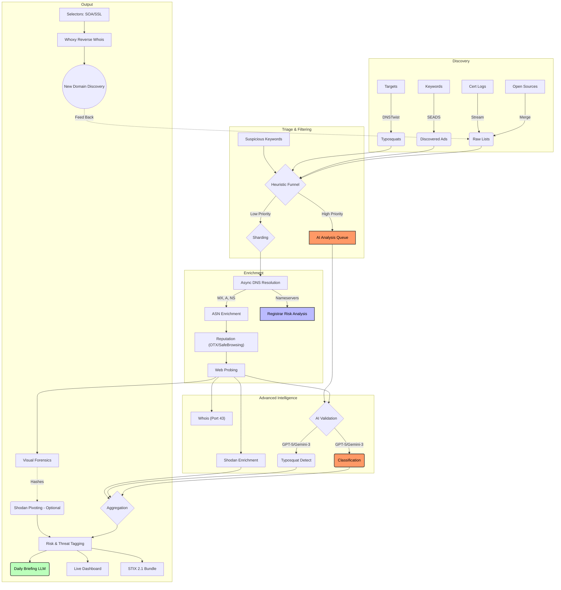

# Disposable & Abuse Domain Intelligence

This repository contains my research and tooling for analyzing disposable email address (DEA) providers and high-abuse domain infrastructure.

The goal of this project is to move beyond simple static blocklists and provide **infrastructure-level intelligence** (MX records, ASNs, and hosting patterns) to help security teams, researchers, and fraud analysts detect abuse families that rotate domains frequently.

> [!NOTE]
> This repository **updates itself automatically** every day via GitHub Actions. The data in `data/` is always current.

## 🛡️ Live Dashboard

View the real-time threat intelligence visualization, now featuring an **AI-generated Daily Briefing**:
> **[👉 View Live Dashboard](https://elchacal801.github.io/domain_intel/)**

## 💡 How to Use This Intelligence

This repository provides different layers of data for different security roles:

### 🛡️ For SOC & Fraud Analysts

* **Block Disposable Email**: Use `data/dea_domains.csv` to block signups from temporary email services.
* **Detect Malicious Ads**: Ingest `data/discovered_ads.csv` to block domains actively abusing search ads.
* **Brand Protection**: Monitor `data/potential_typosquats.csv` for new registrations impersonating your brand.

### 🔬 For Threat Researchers

* **Infrastructure Pivoting**: Use `data/dea_domains_probed.csv` to find patterns.
  * *Example*: "Find all domains hosted on AS12345 that have a page title containing 'Login'."
* **Hosted Scams**: Check `data/risky_asn_list.csv` to identify hosting providers that ignore abuse reports (Bulletproof hosting).

### 🤖 For Engineering/DevOps

* **STIX Integration**: Use `data/domain_intel_bundle.json` to feed this intelligence directly into platforms like OpenCTI or MISP.

## 📂 Project Structure

* **`data/`**: The authoritative source for domain lists and derived intelligence.
  > 📘 **[View Data Dictionary](data/README.md)** for a detailed explanation of every file.

* **`scripts/`**: The Python pipeline.
  * **Core Pipeline**:
    * `merge_lists_v3b.py`: Aggregates and cleans public sources.
    * `split_data.py`: **[NEW]** Splits large datasets for parallel processing (Sharding).
    * `enrich_infrastructure.py`: Performs bulk DNS/ASN resolution.
    * `enrich_reputation.py`: Checks RBLs and queries RDAP.
    * `probe_web.py`: Performs active HTTP/S fingerprinting.
    * `merge_results.py`: **[NEW]** Merges processed shards back into a single dataset.
    * `generate_pivots.py`: Generates intelligence pivot datasets and stats.
    * `export_stix.py`: Exports intelligence to STIX 2.1 JSON.
  * **Infrastructure Intel**:
    * `asn_intel.py`: Fetches and enriches suspicious ASNs.
    * `vpn_intel.py`: Aggregates VPN/VPS provider ASNs.
    * `tor_intel.py`: Tracks Tor Exit Nodes and Tor ASNs.
    * `clean_data.py`: Automated CSV hygiene and schema correction.
    * `enrich_asns.py`: Fetches missing ASN names from RIPE Stat API.
  * **AI Modules**:
    * `ai_typosquat.py`: Uses LLM to detect semantic typosquatting (Limit: 50k/day).
    * `ai_classify_web.py`: Uses LLM to classify web page intent (Limit: 50k/day).
    * `ai_typosquat.py`: Uses LLM to detect semantic typosquatting (Limit: 50k/day).
    * `ai_classify_web.py`: Uses LLM to classify web page intent (Limit: 50k/day).
    * `ai_briefing.py`: Generates the daily dashboard briefing.
  * **Analytics & Whois (New)**:
    * `track_history.py`: Daily tracker for Domain Growth and Liveness (Stats).
    * `drip_whois.py`: Slow, rate-limited Registrar enumeration (Port 43).

* **`docs/`**: Documentation and dashboard code (`index.html`, `app.js`).

## 🚀 Getting Started

### Prerequisites

* Python 3.10+
* `dnspython`, `tqdm`, `requests`, `stix2`
* `litellm`, `python-dotenv` (for AI features)

Install dependencies:

```bash
pip install -r requirements.txt
```

### 🤖 Setting up AI Features

To run the AI modules (`scripts/ai_*.py`), you need API keys.

1. Create a `.env` file in the root directory:

    ```env
    OPENAI_API_KEY=sk-...
    GEMINI_API_KEY=AIza...
    ```

1. For GitHub Actions, add these as **Repository Secrets**.

### Proactive Discovery (New)

* **Ad Intelligence**: `run_seads.py` scans search engines for malicious ads targeting specific keywords (Config: `config/seads_keywords.txt`).
* **Typosquat Generation**: `generate_permutations.py` (via `dnstwist`) generates thousands of potential lookalike domains for high-value targets.
* **Visual Fingerprinting**: `visual_fingerprint.py` uses headless browsers to group domains by visual similarity (pHash), effectively tracking phishing kits.

### Reproducing the Intelligence

1. **Sharding & Enrichment**:
    For large datasets (>10k domains), we use a sharding strategy to avoid network timeouts.

    ```bash
    # 1. Split data
    python scripts/split_data.py --input data/dea_domains.csv --chunks 10
    
    # 2. Process shards (Example for shard 0)
    python scripts/enrich_infrastructure.py --input data/dea_part_0.csv --output temp_0.csv
    python scripts/enrich_reputation.py --input temp_0.csv --output temp_rep_0.csv
    python scripts/probe_web.py --input temp_rep_0.csv --output data/result_part_0.csv
    
    # 3. Merge results
    python scripts/merge_results.py --pattern "data/result_part_*.csv" --output data/dea_domains_probed.csv
    ```

2. **Infrastructure & Hygiene**: Fetch external intel and clean data.

    ```bash
    python scripts/asn_intel.py
    python scripts/clean_data.py
    python scripts/enrich_asns.py
    ```

3. **AI Analysis**: Run the AI tagging and briefing generation.
    *Note: Configured for 50k domains/day.*

    ```bash
    python scripts/ai_typosquat.py --limit 50000 --batch-size 100
    python scripts/ai_classify_web.py --limit 50000 --batch-size 50
    python scripts/ai_briefing.py
    ```

## 🧠 Methodology \& Architecture

### Data Pipeline



### Detection Logic & Triage Funnel

### 1. Discovery & Triage (The Funnel)

To efficiently find threats in a sea of millions of domains without burning millions of API credits, we use a **Tiered Funnel**:

1. **Raw Ingestion**: We ingest ~200k+ domains daily from open sources (`merge_lists_v3b.py`) and proactive discovery (`dnstwist`, `seads`).
2. **Heuristic Triage (`triage_domains.py`)**: A fast, local Python script filters these domains against:
    * **High-Value Targets**: Is it a fuzzy match for "Google", "Amazon", "Citibank"?
    * **High-Signal Keywords**: Does it contain "login", "update", "verify", "secure", "wallet"?
    * **Result**: This reduces the "Haystack" (230k domains) to a "Needle Pile" (~10k candidates).

### 2. Enrichment

The remaining domains are hydrated with deep infrastructure data:

* **Infrastructure**: Who handles email (MX)? Who hosts the server (ASN/IP)?
* **Shodan**: Are there open ports (RDP, C2 panels) or vulnerabilities?
* **Visual Forensics**: Headless browsers capture screenshots and generate perceptual hashes (pHash) to find identical phishing kits.

### 3. AI Analysis (The Laser)

We apply expensive LLM analysis only to the **Triaged Candidates** and **Live Sites**:

* **Typosquatting**: "Is `rnicrosoft.com` malicious?" (GPT-5 Mini).
* **Web Intent**: "Read the title and headers of `secure-login-update.com`. Is it a bank?" (GPT-5 Nano).
* **Daily Briefing**: An automated Analyst summarizes the day's threats into an executive report.

See [docs/detection_logic.md](docs/detection_logic.md) for details on fraud patterns.

### 4. Infrastructure Pivoting (Whoxy)

We use **Reverse Whois** to turn one bad domain into a map of the actor's entire network:

* **Extraction**: We pull unique "Selectors" (SOA Emails, SSL Orgs) from the triaged domains.
* **Pivoting**: We query the **Whoxy API** to find *other* active domains registered by the same emails.
* **Discovery**: This proactively discovers new infrastructure before it is even used in a campaign.

## ⚠️ Responsible Use

This project performs active reconnaissance (HTTP probing) and aggregates data that may be sensitive.

* **Rate Limits**: The web probe script (`probe_web.py`) is rate-limited and uses a clearly identifiable User-Agent (`DomainIntelResearch/1.0`). Please respect target infrastructure.
* **Intent**: This data is for defensive research, fraud prevention, and detection engineering. Do not use it for offensive targeting.
* **Opt-Out**: If you own a domain or ASN listed here and believe it is a false positive (or wish to block our probes), please open a GitHub Issue.

## 📜 License

MIT License. Use this data freely for research or defensive setups. See [LICENSE](LICENSE) for details.
