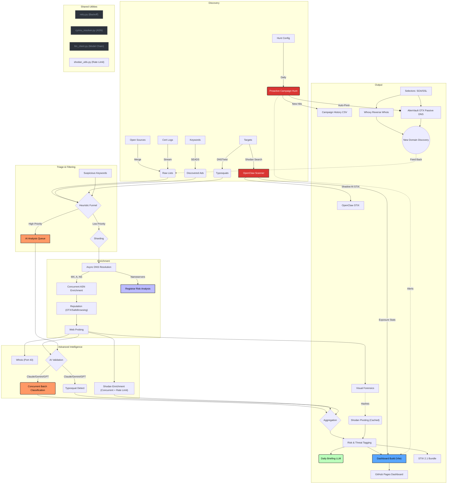

# Disposable & Abuse Domain Intelligence

This repository contains research and tooling for analyzing disposable email address (DEA) providers and high-abuse domain infrastructure.

The goal is to move beyond simple static blocklists and provide **infrastructure-level intelligence** (MX records, ASNs, and hosting patterns) to help security teams, researchers, and fraud analysts detect abuse families that rotate domains frequently.

> [!NOTE]
> This repository **updates itself automatically** every day via GitHub Actions. The data in `data/` is always current.

## Live Dashboard

View the real-time threat intelligence visualization, featuring an **AI-generated Daily Briefing** and **Campaign Tracker**:
> **[View Live Dashboard](https://elchacal801.github.io/domain_intel/)**

## How to Use This Intelligence

This repository provides different layers of data for different security roles:

### For SOC & Fraud Analysts

* **Block Disposable Email**: Use `data/dea_domains.csv` to block signups from temporary email services.
* **Detect Malicious Ads**: Ingest `data/discovered_ads.csv` to block domains actively abusing search ads.
* **Brand Protection**: Monitor `data/potential_typosquats.csv` for new registrations impersonating your brand.

### For Threat Researchers

* **Infrastructure Pivoting**: Use `data/dea_domains_probed.csv` to find patterns.
  * *Example*: "Find all domains hosted on AS12345 that have a page title containing 'Login'."
* **Hosted Scams**: Check `data/risky_asn_list.csv` to identify hosting providers that ignore abuse reports (Bulletproof hosting).
* **Campaign Tracking**: Review `data/campaign_hunt_history.csv` for new infrastructure discovered by automated Shodan hunts.

### For Engineering/DevOps

* **STIX Integration**: Use `data/domain_intel_bundle.json` to feed this intelligence directly into platforms like OpenCTI or MISP.
* **Shadow AI Detection**: Use `data/openclaw_stix.json` to ingest indicators of compromised AI agents (OpenClaw/Moltbot) into your SIEM.
* **Dashboard Summary**: Use `data/dashboard_summary.json` for pre-computed KPIs without parsing large CSVs.

## Project Structure

* **`frontend/`**: Vite + vanilla JS dashboard application (source).
  * Built with `npm run build` and output to `docs/` for GitHub Pages deployment.
  * 4 tabbed views: Overview, Threats, Infrastructure, Campaigns.

* **`scripts/`**: The Python pipeline.
  * **Shared Utilities** (`scripts/shared/`):
    * `retry.py`: Exponential backoff decorator with sync/async support.
    * `cymru_resolver.py`: Centralized Team Cymru DNS enrichment for ASN/IP data.
    * `llm_client.py`: Unified LLM wrapper (LiteLLM) with model fallback chains and JSON parsing.
  * **Core Pipeline**:
    * `merge_lists_v3b.py`: Aggregates and cleans public sources.
    * `split_data.py`: Splits large datasets for parallel processing (Sharding).
    * `enrich_infrastructure.py`: Performs bulk DNS/ASN resolution.
    * `enrich_reputation.py`: Checks RBLs and queries RDAP.
    * `probe_web.py`: Performs active HTTP/S fingerprinting.
    * `merge_results.py`: Merges processed shards back into a single dataset.
    * `generate_pivots.py`: Generates intelligence pivot datasets and stats.
    * `build_dashboard_data.py`: Generates pre-computed dashboard summary JSON.
    * `export_stix.py`: Exports intelligence to STIX 2.1 JSON.
    * `hunt_campaign.py`: Proactively hunts for specific campaign infrastructure using Shodan.
  * **Shadow AI Scanner**:
    * `openclaw_scan.py`: Scans for exposed OpenClaw/Moltbot/Gateway AI agents on port 18789.
    * `openclaw_stix.py`: Converts OpenClaw findings to STIX 2.1 bundles.
    * `shodan_utils.py`: Shared utility for safe Shodan scanning (Credit Budgeting + Caching + Thread Safety).
  * **Infrastructure Intel**:
    * `asn_intel.py`: Concurrent fetch and enrich suspicious ASNs.
    * `vpn_intel.py`: Aggregates VPN/VPS provider ASNs.
    * `tor_intel.py`: Tracks Tor Exit Nodes and Tor ASNs.
    * `clean_data.py`: Automated CSV hygiene and schema correction.
    * `enrich_asns.py`: Fetches missing ASN names from RIPE Stat API.
  * **Rate Limiting**:
    * `enrich_shodan.py`: Strictly enforced **1 Request Per Second (RPS)** to comply with API limits. Uses a `CreditBudget` singleton and thread-safe `RateLimiter`.
    * `enrich_technical.py`: Uses 50 concurrent workers for DNS/SSL but limits processing volume per run (default 5k) to prevent timeouts.
    * `ai_*.py`: Limits concurrency (3 workers) and batch sizes (2k items/run) to fit within 40m timeout.
  * **AI Modules**:
    * `ai_typosquat.py`: Uses LLM to detect semantic typosquatting.
    * `ai_classify_web.py`: Uses LLM to concurrently classify web page intent (Batch Processing).
    * `ai_briefing.py`: Generates the daily dashboard briefing (includes FLAME evidence candidates).
  * **FLAME Integration**:
    * `generate_evidence.py`: Generates [FLAME](https://github.com/elchacal801/flame-fraud)-formatted evidence packages from investigation clusters. Supports dry-run, duplicate checking, and configurable thresholds.
  * **Analytics & Whois**:
    * `track_history.py`: Daily tracker for Domain Growth and Liveness (Stats).
    * `drip_whois.py`: Slow, rate-limited Registrar enumeration (Port 43).

* **`data/`**: The authoritative source for domain lists and derived intelligence.
  > **[View Data Dictionary](data/README.md)** for a detailed explanation of every file.

* **`docs/`**: GitHub Pages deployment directory (built from `frontend/`).

* **`tests/`**: Unit tests for shared utilities and enrichment logic.

## Getting Started

### Prerequisites

* Python 3.10+
* Node.js 20+ (for dashboard builds)
* `dnspython`, `tqdm`, `requests`, `stix2`
* `litellm`, `python-dotenv` (for AI features)

Install dependencies:

```bash
pip install -r requirements.txt
cd frontend && npm install
```

### Setting up AI Features

To run the AI modules (`scripts/ai_*.py`), you need API keys.

1. Create a `.env` file in the root directory:

    ```env
    OPENAI_API_KEY=sk-...
    GEMINI_API_KEY=AIza...
    ANTHROPIC_API_KEY=sk-ant-...
    ```

2. For GitHub Actions, add these as **Repository Secrets**.

The model priority chain is configured centrally in `scripts/shared/llm_client.py`:

* Primary: `claude-sonnet-4-5-20250929`
* Secondary: `gemini-3-pro-preview`
* Fallback: `gpt-4o`

### Proactive Discovery

* **Ad Intelligence**: `run_seads.py` scans search engines for malicious ads targeting specific keywords (Config: `config/seads_keywords.txt`).
* **Typosquat Generation**: `generate_permutations.py` (via `dnstwist`) generates thousands of potential lookalike domains for high-value targets.
* **Visual Fingerprinting**: `visual_fingerprint.py` uses headless browsers to group domains by visual similarity (pHash), tracking phishing kits.

### Reproducing the Intelligence

1. **Sharding & Enrichment**:
    For large datasets (>10k domains), we use a sharding strategy to avoid network timeouts.

    ```bash
    # 1. Split data
    python scripts/split_data.py --input data/dea_domains.csv --chunks 10
    
    # 2. Process shards (Example for shard 0)
    python scripts/enrich_infrastructure.py --input data/dea_part_0.csv --output temp_0.csv
    python scripts/enrich_reputation.py --input temp_0.csv --output temp_rep_0.csv
    python scripts/probe_web.py --input temp_rep_0.csv --output data/result_part_0.csv
    
    # 3. Merge results
    python scripts/merge_results.py --pattern "data/result_part_*.csv" --output data/dea_domains_probed.csv
    ```

2. **Infrastructure & Hygiene**: Fetch external intel and clean data.

    ```bash
    python scripts/asn_intel.py
    python scripts/clean_data.py
    python scripts/enrich_asns.py
    ```

3. **AI Analysis**: Run the AI tagging and briefing generation.

    ```bash
    python scripts/ai_typosquat.py --limit 50000 --batch-size 100
    python scripts/ai_classify_web.py --limit 50000 --batch-size 50
    python scripts/ai_briefing.py
    ```

4. **FLAME Evidence**: Generate evidence packages for the FLAME framework.

    ```bash
    python scripts/generate_evidence.py --dry-run    # Preview
    python scripts/generate_evidence.py               # Generate packages
    ```

5. **Dashboard Build**: Build the frontend and generate the summary manifest.

    ```bash
    python scripts/build_dashboard_data.py
    cd frontend && npm run build
    ```

## Methodology & Architecture

### Data Pipeline



### Detection Logic & Triage Funnel

### 1. Discovery & Triage (The Funnel)

To efficiently find threats in a sea of millions of domains without burning millions of API credits, we use a **Tiered Funnel**:

1. **Raw Ingestion**: We ingest ~200k+ domains daily from open sources (`merge_lists_v3b.py`) and proactive discovery (`dnstwist`, `seads`).
2. **Heuristic Triage (`triage_domains.py`)**: A fast, local Python script filters these domains against:
    * **High-Value Targets**: Is it a fuzzy match for "Google", "Amazon", "Citibank"?
    * **High-Signal Keywords**: Does it contain "login", "update", "verify", "secure", "wallet"?
    * **Result**: This reduces the "Haystack" (230k domains) to a "Needle Pile" (~10k candidates).

### 2. Enrichment

The remaining domains are hydrated with deep infrastructure data:

* **Infrastructure**: Who handles email (MX)? Who hosts the server (ASN/IP)?
* **Shodan**: Are there open ports (RDP, C2 panels) or vulnerabilities?
* **Visual Forensics**: Headless browsers capture screenshots and generate perceptual hashes (pHash) to find identical phishing kits.

### 3. AI Analysis (The Laser)

We apply expensive LLM analysis only to the **Triaged Candidates** and **Live Sites**:

* **Typosquatting**: "Is `rnicrosoft.com` malicious?" (Claude 4.6 Sonnet with Gemini/GPT fallback).
* **Web Intent**: "Read the title and headers of `secure-login-update.com`. Is it a bank?" (Model chain via `shared/llm_client.py`).
* **Daily Briefing**: An automated analyst summarizes the day's threats into an executive report.

See [docs/detection_logic.md](docs/detection_logic.md) for details on fraud patterns.

### 4. Infrastructure Pivoting (Whoxy)

We use **Reverse Whois** to turn one bad domain into a map of the actor's entire network:

* **Extraction**: We pull unique "Selectors" (SOA Emails, SSL Orgs) from the triaged domains.
* **Pivoting**: We query the **Whoxy API** to find *other* active domains registered by the same emails.
* **Discovery**: This proactively discovers new infrastructure before it is even used in a campaign.

## Responsible Use

This project performs active reconnaissance (HTTP probing) and aggregates data that may be sensitive.

* **Rate Limits**: The web probe script (`probe_web.py`) is rate-limited and uses a clearly identifiable User-Agent (`DomainIntelResearch/1.0`). Please respect target infrastructure.
* **Intent**: This data is for defensive research, fraud prevention, and detection engineering. Do not use it for offensive targeting.
* **Opt-Out**: If you own a domain or ASN listed here and believe it is a false positive (or wish to block our probes), please open a GitHub Issue.

## License

MIT License. Use this data freely for research or defensive setups. See [LICENSE](LICENSE) for details.
